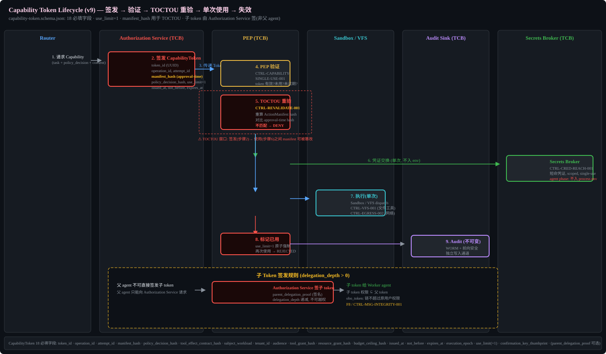
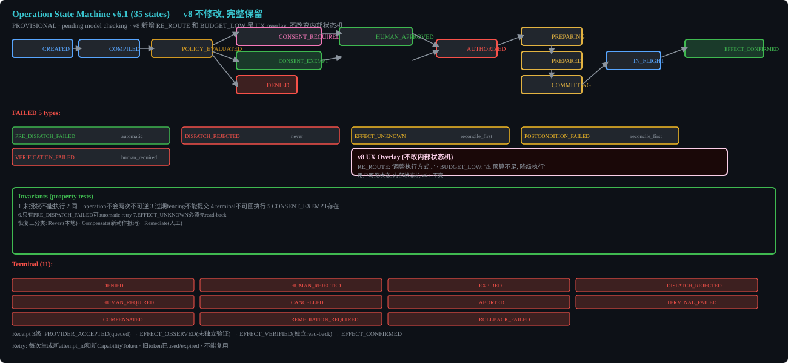

# Action Control





## Tool Execution Pipeline (12 steps)
1. Schema validation
2. Effect classification (EffectRisk)
3. Risk derivation (EffectRisk + Policy + Context -> DerivedRiskTier)
4. Policy evaluation (PEP)
5a. Pre-Approval Auto-Review (G-CX1, only if DerivedRiskTier >= T3): reviewer agent evaluates ActionManifest; may downgrade (advisory) / confirm / escalate (binding)
5b. Consent check (original step 5)
6. Capability issuance (Authorization Service signs)
7. PEP validation (verify token valid, not expired, not used)
   - 7b. TOCTOU re-validation: recompute ActionManifest hash, compare to hash captured at approval time (CTRL-REVALIDATE-001). Mismatch → deny.
8. Credential exchange (Secret Broker provides short-lived credential, single-use, scoped to this dispatch). In agent phase, credential is NOT placed in process env; it is injected into the tool dispatch and zeroed after. See FG2 RunPhase / CTRL-CRED-REACH-001.
9. Sandbox/environment dispatch (file-touching tools dispatch through VFS — see architecture/virtual-filesystem.md FG4; VFS enforces permission rules for both tool calls and RAG retrieval, closing the read_file-deny bypass)
10. Receipt capture
11. Postcondition verification
12. Audit (immutable audit event)

## v9 Corrections
- Policy enters BEFORE routing (not after)
- PEP at EVERY action (not just plan validation)
- Child Capability signed by Authorization Service (NOT parent)
- EffectRisk replaces static risk tiers
- Email compensation = unavailable (NOT retractable)
- Re-route creates new RunPlan revision + revokes old capabilities
- PEP enforces deny-by-default (per trust-boundaries.md): every action denied unless explicitly allowed by Policy
- step 5 split into 5a (Pre-Approval Auto-Review, G-CX1) + 5b (Consent check)

## Permission authorities

There is no “security router.” Routing can propose an action, but these independent authorities make the binding decision:

| Authority | Owns | Cannot do |
|-----------|------|-----------|
| Identity/Auth | principal and authenticated session | grant a tool action by itself |
| Policy Decision Point | deny-by-default user/org/product rules and derived consent requirement | issue a Capability or handle secrets |
| Consent Service | exact user approval record for the shown ActionManifest | expand the approved manifest |
| Authorization Service | short-lived, attenuated, single-use Capability bound to manifest/run/step/tool/effect | override Policy or consent |
| PEP / Execution Supervisor | per-action schema, token, TOCTOU, budget, VFS, sandbox and egress enforcement | create policy or self-approve |
| Secrets Broker | single-exchange credential scoped to one authorized dispatch | expose credentials to the loop environment |
| Audit Sink | immutable decisions, receipts and denials | participate in execution |

Every tool, skill-triggered tool, RAG file access, model/API call, scheduled activation and child-agent action crosses the relevant enforcement point. A Router, Skill, Tool Registry, memory record, hook, or model output cannot grant permission.


## Implementation Notes

### Tool Execution Pipeline (12 steps)

```typescript
async function executeToolCall(call: ToolCall, ctx: ExecutionContext): Promise<ToolResult> {
  // 1. Schema validation
  validateInput(call.tool_name, call.args);
  // 2. Effect classification
  const effectRisk = extractEffectRisk(call.tool_name, call.args, ctx);
  // 3. Risk derivation
  const derivedRisk = deriveRiskTier(effectRisk, ctx.userPolicy, ctx.orgPolicy, ctx.context);
  // 4. Policy evaluation
  const policyDecision = policyEngine.evaluate(call, derivedRisk, ctx);
  if (!policyDecision.allowed) throw new PolicyDeniedError(policyDecision.reasons);
  // 5. Consent check
  const consentReq = deriveConsentRequirement(derivedRisk);
  if (consentReq.required) await requestHumanConsent(call, consentReq);
  // 6. Capability issuance
  const capability = await authorizationService.issueCapability(call, policyDecision, consentReq);
 // 7. PEP validation
 pep.validate(capability); // throws if expired, used, or invalid
  // 7b. TOCTOU re-validation: recompute ActionManifest hash and compare to the hash captured at approval time (CTRL-REVALIDATE-001). Mismatch means the manifest was modified between approval and execution — deny.
  const approvedHash = capability.manifest_hash;
  const currentHash = computeActionManifestHash(call);
  if (approvedHash !== currentHash) throw new ManifestTamperedError('ActionManifest hash mismatch — TOCTOU detected');
  // 8. Credential exchange (FG2: single-use, scoped, never persisted in agent env)
  const credential = await secretBroker.exchange(capability.credential_scope, {
    runPhase: ctx.runPhase,           // setup | agent
    singleUse: true,
    noEnvLeak: ctx.runPhase === "agent", // agent phase: strip from env after dispatch
  });
  // 9. Sandbox dispatch (file-touching tools go through VFS — FG4)
  const result = await sandbox.execute(call, credential, ctx.environment, { vfs: isFileTouching(call) });
  // 10. Receipt capture
  const receipt = captureReceipt(result);
  // 11. Postcondition verification
  verifyPostconditions(call, result);
  // 12. Audit
  audit.log({ call, capability, result, receipt, timestamp: Date.now() });
  return result;
}
```

### EffectRisk Extraction
Each ToolSpec has a `risk_feature_extractor` field pointing to a function that returns EffectRisk.
Agent should implement extractors per tool during Phase 1.

### Risk Tier Derivation
```
EffectRisk + UserPolicy + OrgPolicy + Context → DerivedRiskTier (0-5)
```
- Tier 0-1: auto-approve
- Tier 2: session confirm
- Tier 3: session confirm + exact preview
- Tier 4: recent_password
- Tier 5: webauthn

Agent should tune tier thresholds during Phase 1 security testing.
