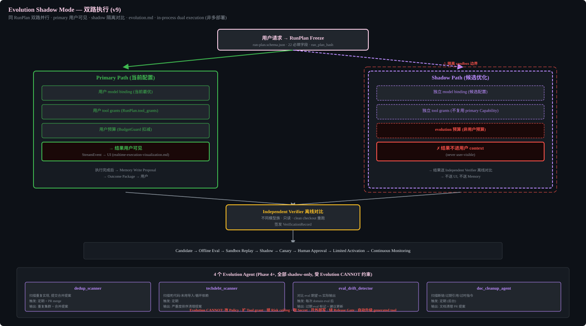

# Evolution (v9: Shadow Mode Only)




## Pipeline
Observe -> Candidate -> Offline Eval -> Sandbox Replay -> Shadow -> Canary -> Human Approval -> Limited Activation -> Continuous Monitoring

## CANNOT (v9 hard constraints)
- Modify Policy
- Expand Tool grant
- Raise Risk ceiling
- Obtain Secrets
- Enable external write
- Bypass Release Gate
- Auto-promote generated tools to trusted

## Two non-overlapping evolution tracks

| Track | Input | Output | Authority |
|-------|-------|--------|-----------|
| User adaptation | Explicitly consented interactions and corrections | Preference/workflow/communication proposals with provenance, TTL, inspect/correct/delete | Memory approval and user controls; never changes agent permissions or capability code |
| Agent capability evolution | Eval failures, traces, replay and repository observations | Prompt/config/workflow/skill/generated-tool candidates | Offline eval, sandbox replay, shadow, rollback/quarantine and human certification; never reads unconsented user memory |

The tracks may share the evaluation infrastructure but not training data, approval state, trust score, or promotion path.

### Evolution Agents (Phase 4+)
Four specialized evolution agents run in the Optimize stage. All are shadow-only (proposals, never direct changes) and bound by Evolution CANNOT constraints above.

| Agent | Purpose | Trigger | Output |
|-------|---------|---------|--------|
| dedup_scanner | Scan codebase for duplicated/reimplemented functionality (LLM-generated code frequently reinvents existing helpers). Reports near-duplicate implementations with merge proposals. | Periodic + on PR merge | Dedup report with duplicate clusters + merge proposals |
| techdebt_scanner | Scan for accumulated technical debt: dead code, unused imports, circular deps (madge), stale types, broken abstractions. | Periodic | Tech debt report with severity-ranked cleanup proposals |
| eval_drift_detector | Compare eval expected results against actual agent output. If an eval's expected result no longer matches reality (spec changed, behavior changed), flag it as stale. Prevents frozen evals from silently rotting. | After each domain eval run | Stale eval flags with suggested updates |
| doc_cleanup_agent | Scan docs (AGENTS.md references, design-docs, exec-plans) for broken links, stale references, outdated instructions. Submits cleanup proposals as PRs. Agent-for-agent doc maintenance. | Periodic (background) | Doc cleanup PR proposals |

### Shadow Deployment (Phase 4)
Shadow mode implementation: the same RunPlan executes two paths in parallel — the primary path (current code/config) and the shadow path (candidate optimization). Only the primary result is returned to the user. The shadow result is compared offline by the Independent Verifier. This requires:
- Shadow path runs in an isolated sandbox with its own model binding and tool grants
- Shadow results are never user-visible; they feed the Evolution pipeline's Offline Eval stage
- Shadow runs do NOT consume user budget; they consume a separate evolution budget
- Shadow deployment is NOT multi-deployment (no separate server); it is in-process dual execution within the Runtime

Primary path: user model binding + user tool grants + user budget → result user-visible → StreamEvent to UI → Memory Write Proposal → Outcome Package.
Shadow path: independent model binding + independent tool grants (no reuse of primary Capability) + evolution budget → result NOT in user context → sent to Independent Verifier for offline comparison → NOT sent to UI or Memory.

## Four-Stage Cycle
Observe -> Extract -> Synthesize -> Optimize
Phase 1: Observe only. Phase 4: Full cycle.

## Cold Start Safety
N<10: pure rules. 10<=N<50: linear weight. N>=50: weight=0.3.
Failure: 2 consecutive -> weight -0.2, 3 consecutive -> quarantine.
Self-Model: confidence<0.5 -> weight=0.


## Implementation Notes

### Evolution Pipeline (shadow mode only)
```
Observe → Candidate → Offline Eval → Sandbox Replay → Shadow → Canary → Human Approval → Limited Activation
```

### Cold Start Safety (agent-tunable thresholds)
- N < 10: pure rules, no history reading
- 10 <= N < 50: weight = (N-10)/40 * 0.3
- N >= 50: weight = 0.3
- Failure: 2 consecutive → weight -0.2, 3 consecutive → quarantine
- Self-Model: confidence < 0.5 → weight = 0

### Evolution CANNOT (hard constraints)
- Modify Policy
- Expand Tool grant
- Raise Risk ceiling
- Obtain Secrets
- Enable external write
- Bypass Release Gate
- Auto-promote generated tools to trusted
