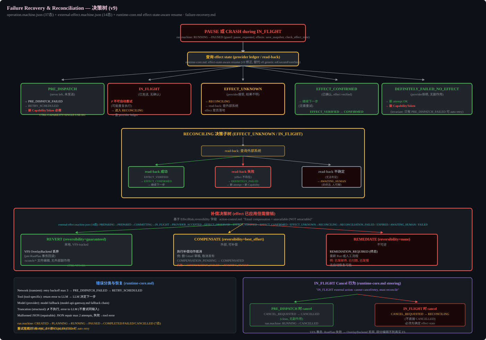

# Failure Recovery & Reconciliation

## Purpose

Defines the decision path when a tool execution fails, when an external effect is unknown, or when a Run must be paused and resumed. The `operation.machine.json` (37 states) and `external-effect.machine.json` (14 states) define the states and transitions, but no spec connects them into an actionable decision tree. Without this, Phase 1 implementers do not know which recovery path to take when `IN_FLIGHT` crashes or `EFFECT_UNKNOWN` occurs.

## Effect-State-Aware Resume (v9 correction, replaces v8 generic reExecuteFromStep)

When a Run is paused or crashes during `IN_FLIGHT`, the runtime must query the effect state before deciding whether to retry. This replaces v8's generic reExecuteFromStep with a state-aware decision.

### Decision Tree: PAUSE or CRASH during IN_FLIGHT

`run.machine`: RUNNING → PAUSED (guard: pause_requested, effects: save_snapshot, check_effect_state)

| Effect State | Meaning | Recovery Action |
|--------------|---------|-----------------|
| PRE_DISPATCH | Never left, never sent | → PRE_DISPATCH_FAILED → RETRY_SCHEDULED → new CapabilityToken required (CTRL-CAPABILITY-SINGLE-USE-001) |
| IN_FLIGHT | Sent, no confirmation | ✗ Cannot auto-retry (may duplicate execution) → enter RECONCILING → query provider ledger |
| EFFECT_UNKNOWN | Provider accepted, result unclear | → RECONCILING → read-back: query external system for effect status |
| EFFECT_CONFIRMED | Confirmed, effect verified | → Continue to next step (no retry needed). EFFECT_VERIFIED → EFFECT_CONFIRMED |
| DEFINITELY_FAILED_NO_EFFECT | Provider rejected, no side effect | → New attempt OK → new CapabilityToken |

**Invariant**: Only PRE_DISPATCH_FAILED can auto-retry. All other states require either read-back or human intervention.

### RECONCILING Decision Subtree (EFFECT_UNKNOWN / IN_FLIGHT)

| Read-back Result | Action |
|------------------|--------|
| Read-back succeeds, effect verified | → EFFECT_VERIFIED → EFFECT_CONFIRMED → continue next step |
| Read-back fails, effect does not exist | → DEFINITELY_FAILED → new attempt + new CapabilityToken |
| Read-back indeterminate (cannot determine) | → AWAITING_HUMAN (non-terminal, human can resolve) |

## Compensation Decision Tree (effect applied, needs undo)

Based on `EffectRisk.reversibility` field. `action-control.md`: "Email compensation = unavailable (NOT retractable)."

`external-effect.machine.json` (14 states): PREPARING→PREPARED→COMMITTING→IN_FLIGHT→PROVIDER_ACCEPTED→EFFECT_OBSERVED→EFFECT_VERIFIED→EFFECT_CONFIRMED / EFFECT_UNKNOWN→RECONCILING→RECONCILIATION_FAILED / EXPIRED / AWAITING_HUMAN / FAILED

| Reversibility | Strategy | Details |
|--------------|----------|---------|
| guaranteed | REVERT (local, VFS-tracked) | VFS OverlayBackend discard (per-RunPlan transaction rollback). /scratch/* file edits, no external side effect. CTRL-VFS-001. |
| best_effort | COMPENSATE (external, can compensate) | Execute compensating action to undo. Example: delete Gmail draft, cancel publication. COMPENSATION_PENDING → COMPENSATED. Failure → COMPENSATION_FAILED → AWAITING_HUMAN. |
| none | REMEDIATE (irreversible) | REMEDIATION_REQUIRED (terminal state). Requires new Run or human process. Example: email already sent, payment already made, tweet already posted. No automatic recovery possible. |

## Error Classification & Recovery (runtime-core.md)

| Error Type | Classification | Action |
|------------|---------------|--------|
| Network | transient | retry with backoff (max 3) → PRE_DISPATCH_FAILED → RETRY_SCHEDULED |
| Tool | tool-specific | return error to LLM → LLM decides next step |
| Model | provider-specific | model fallback (model-api-gateway.md fallback chain) |
| Truncation | structural | ✗ do NOT execute, error to LLM (do not retry same input) |
| Malformed JSON | repairable | JSON repair (max 2 attempts), failure → tool error |

`run.machine`: CREATED→PLANNING→RUNNING→PAUSED→COMPLETED/FAILED/CANCELLED (7 states)

## Retry Rules

- Only PRE_DISPATCH_FAILED can auto-retry
- Retry generates new attempt_id + new CapabilityToken
- IN_FLIGHT cannot be cancelled — must reconcile first

## IN_FLIGHT Cancel Behavior (runtime-core.md steering)

`IN_FLIGHT external action: cannot cancel/retry, must reconcile`

| Cancel Timing | Behavior |
|---------------|---------|
| PRE_DISPATCH cancel | CANCEL_REQUESTED → CANCELLED (clean, no side effect). run.machine: RUNNING→CANCELLED |
| IN_FLIGHT cancel | CANCEL_REQUESTED → RECONCILING (not directly CANCELLED). Must determine effect state first. |

## VFS Transaction

RunPlan failure → OverlayBackend discards, partial edits never reach real FS. See `virtual-filesystem.md`.

