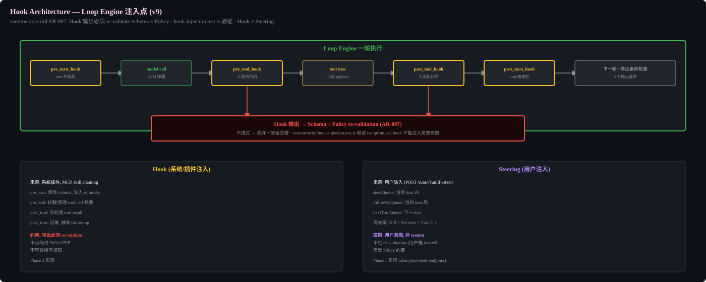
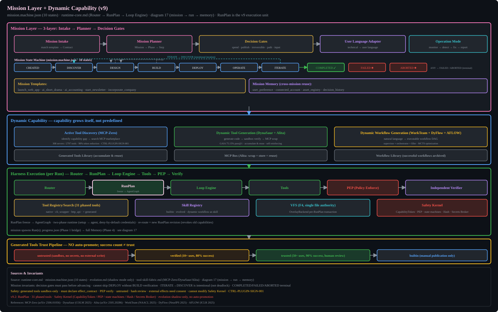

# Harness Boundary




## Definition
Agent Harness is the complete product technical system containing 14 modules. It is permanent. Router generates RunPlan; Runtime Core executes it. The Harness is NOT rebuilt per task.

## 14 Modules
1. Prompt & Instruction System
2. Context & Data System (RAG 5 subsystems)
3. Model & API Gateway (Capability Registry)
4. Router & Orchestration System (dependency-aware DAG)
5. Agent Runtime Core (Loop/Scheduler/State/Streaming)
6. State System (Conversation + Workflow)
7. Memory System (6 types + Provenance)
8. Tools/Skills/Function Call/MCP
9. Execution Environment & Sandbox
10. Action Control & Human Review (Policy/Consent/Capability/PEP)
11. Retry/Recovery/Reconciliation
12. Assurance & Verification (Independent Verifier)
13. Observability & Audit (Tracing/Profiler/Replay/Anomaly)
14. Evaluation & Evolution (Observe/Extract/Synthesize/Optimize)

### Phase ownership without duplicate subsystems

| Phase | Adds or completes |
|-------|-------------------|
| 1 | Complete single-agent product kernel: static intent Router, provider/tool/skill registries, three reasoning strategies, durable runtime, nine local tools, eight base skills, VFS/sandbox/permission chain, evidence and base eval |
| 2 | Context engineering, progressive disclosure, RAG, multimodal/document expansion, richer session control, product UX and optional rootless OCI adapter |
| 3 | Full adaptive Router DAG and multi-agent orchestration; extends the Phase 1 Router contract |
| 4 | Cross-session memory, consented personalization, advanced assurance/observability, and shadow-only capability evolution |
| 5 | Certified external effects and provider reconciliation |
| 6 | Durable missions, cron/routines, proactive/mobile/voice surfaces and sandbox sleep/wake |
| 7 | Enterprise identity/policy/tenant controls and microVM isolation |
| 8 | Production certification and operations only; no new runtime authority |

Security controls, registry snapshots, event sourcing, Evidence Packages and budgets are cross-cutting invariants, not separate late-phase replacements.

## Module Boundary Table (can/cannot)
See requirements and module-boundaries.md for detailed can/cannot table for each module.

## Non-Goals
- Does not train foundation models
- Does not allow model to self-grant permissions
- Does not require all tasks to use Agent or multi-Agent
- Does not promise all providers support transactions
- Does not call compensation "rollback"
- Does not store private chain-of-thought
- Does not allow generated tools to auto-obtain production permissions


## Mission Layer Architecture



## Implementation Notes

### Module Package Structure

```
harness/
├── runtime/          # Loop Engine, Session, Scheduler
├── router/           # Router DAG, Task Profiler, Constraint Solver
├── security/         # Policy Engine, PEP, Capability, Authorization Service
├── tools/            # Tool implementations (read_file, write_file, etc.)
│   └── registry      # ToolRegistry/tool_search; same frozen snapshot used by Router and Runtime
├── skills/           # SkillRegistry/skill_search, declarative base/project/global/enterprise skills
├── context/          # Context Compiler, Compaction, Context Window Layout
├── memory/           # Memory Store, Consolidation, Provenance
├── rag/              # Ingestion, Indexing, Retrieval, Reranking
├── vfs/              # Virtual Filesystem (FG4): single file-access authority, backend routing, OverlayBackend transactions
├── sandbox/          # Process isolation, resource limits
├── hooks/            # Hook system
├── steering/         # 3-queue steering
├── verification/     # Independent verifier, evidence collection
├── observability/    # Tracing, metrics, OTel export
├── evolution/        # Evolution shadow mode
├── missions/         # Mission layer, routines, watches
├── external/         # External action adapters (Gmail, Calendar, etc.)
├── enterprise/       # Multi-tenant, RBAC, admin
├── ui/               # Frontend (Next.js, shared with apps/)
├── ingestion/        # Document ingestion (PDF, DOCX, etc.)
├── multimodal/       # Image gen, vision, audio
├── mobile/           # Push notifications, channels, remote steer (Phase 6)
└── tests/            # Test files
```

### Inter-Module Communication
Modules communicate via:
1. Typed function calls (same process, Phase 1-3)
2. Event bus (for async, Phase 4+)
3. tRPC (for API exposure, Phase 2+)

Contract and registry snapshot references cross module boundaries; implementations do not import upward-layer concrete classes.

### Module Independence
Each module has its own package.json exports. Dependencies flow downward:
- router depends on: contracts, registry read interfaces, and Policy constraints
- runtime depends on: contracts plus security/context/VFS/gateway interfaces and consumes RunPlan revisions
- tools depend on: Tool Registry interfaces, security (PEP), VFS, and sandbox
- No circular dependencies. Agent should verify with `madge --circular` during build.
