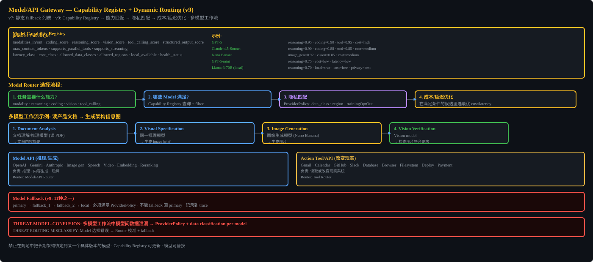

# Model/API Gateway




## Capability Registry (expanded for all domains)
text_reasoning, code, long_context, structured_output, tool_calling, vision_understanding, pdf_document_understanding, image_generation, image_editing, audio_understanding, speech_generation, video_understanding, video_generation, embedding, reranking, local_execution, data_region, data_retention, pricing, health_state

## Provider Adapter Must Implement
request_normalizer, structured_output_handler, tool_call_normalizer, response_parser, streaming_event_handler, error_mapper, usage_meter, rate_limiter, circuit_breaker, health_checker, data_policy_validator, fallback_compatibility_checker

## Model Switch Must Re-validate
- Context length
- Tool definitions serialization
- Data policy
- Structured output format
- Plan compatibility

## Multi-Model Workflow Examples
PDF Research: document model -> reasoning -> reranker -> writing -> verifier
Image Task: reasoning -> image gen -> vision verify


## Implementation Notes

### Provider Adapter Interface

```typescript
interface ProviderAdapter {
  normalizeRequest(messages: Message[], tools: ToolDef[], config: ModelConfig): NormalizedRequest;
  parseResponse(raw: any): ParsedResponse;
  normalizeToolCall(raw: any): NormalizedToolCall;
  streamEvents(raw: Stream): AsyncGenerator<StreamEvent>;
  mapError(error: any): MappedError;
  meterUsage(raw: any): UsageMetrics;
  checkHealth(): Promise<HealthStatus>;
  validateDataPolicy(policy: ProviderPolicy): boolean;
}
```

### Model Switch Re-validation Checklist
When switching from model A to model B:
1. Re-validate context length (B.max_context >= current_tokens)
2. Re-serialize tool definitions (B may use different tool format)
3. Re-validate data policy (B.provider must satisfy ProviderPolicy)
4. Re-compile structured output format (B may use different JSON mode)
5. Re-validate plan compatibility (B must support required capabilities)

### Fallback Chain
```
primary → fallback_1 → fallback_2 → local_model → cascade_failure_handler
```
- Cannot fallback back to primary (prevents loops)
- Each fallback re-runs the re-validation checklist
- Cascade failure: durable pause + notify user + retry every 5 min (agent-tunable)

### Multi-Model Workflow
Agent should implement as a DAG of model calls, not a sequence. Each node specifies which model capability is needed. The Gateway resolves to a specific provider+model.

## Prompt Cache Engineering (FG5 / FG11)

The 7-layer context window (context-memory-rag.md) already assumes prefix caching (system/policy layer and recent-conversation layer are marked "cached prefix"). The Gateway must manage the cache, not just assume it. KV-cache hit rate is the single most important production metric for long agent loops and multi-agent DAGs (Phase 3): uncached input tokens cost ~10x cached tokens on frontier models, and a 50-tool-call x N-agent DAG with all-miss cache is economically infeasible inside BudgetGuard.

### Cache layers and invalidation matrix

| Layer | Content | Invalidated when |
|-------|---------|------------------|
| System prompt | Core instructions, tool definitions | Set of tool definitions changes, model upgrade |
| Conversation | Messages, tool results | Every turn (only new tail is uncached) |

Cache key includes: model id, effort level, fast-mode flag. Switching any of these recomputes the full request.

Actions that invalidate the cache (Gateway must track and minimize):
- Model switch (including fallback chain hops and plan-mode model toggle)
- Effort level change
- Connecting/disconnecting an MCP server whose tools are loaded into the prefix
- Compaction / context_reset (rewrites or clears the conversation layer)
- RunPhase switch (setup→agent) (G-CC2): setup phase credentials stripped and setup-only tools unavailable at agent phase entry. If system prompt or tool-definition block referenced setup-phase state, System prompt cache layer invalidates. If tool definitions stable (setup tools masked via FG5, not removed) and credentials never in prompt, cache preserved. Gateway checks: did setup phase write anything into stable prefix?

### Tool-masking state machine (FG5)

Dynamic tool addition/removal (MCP allowlist, generated tools, skill chaining) re-serializes the tool-definition block and invalidates the system-prompt cache layer. To preserve the cache, AH keeps tool definitions STABLE in the prompt and constrains action selection at decode time:
- Tool names use consistent prefixes (`fs_*`, `web_*`, `browser_*`, `screen_*`) so a state machine can mask groups without editing definitions.
- A context-aware state machine masks tool-name token logits during decoding (where the provider supports response prefill / constrained decoding) to enable/disable tools per state without touching definitions.
- Where masking is unsupported, prefer deferring tool definitions via tool-search (load on demand) so the prefix stays stable; never hot-swap definitions mid-loop.

This control is CTRL-TOOL-MASK-001. It is a launch blocker for Phase 3 multi-agent, not an optimization: without it, BudgetGuard kills runs because cache all-miss makes each multi-agent DAG node a full forward pass.

Enabled via RunPlan `context_strategy.tool_masking = true`. The Gateway reads `context_strategy.cache_breakpoints` to place explicit cache breakpoints at stable-prefix boundaries (system prompt end, tool-definition block end).

### Cache-aware compaction (FG10 coupling)

Compaction (context-memory-rag.md) and context_reset rewrite the conversation layer and break the cached prefix. Compaction triggers must align with cache breakpoints: compact at a breakpoint boundary so the post-compaction prefix is still a cache hit for the stable portion. See context-memory-rag.md FG10 for mechanical offloading that defers compaction.

Summarization threshold is `context_strategy.summarize_at_window_ratio` (default 0.85 of max_input_tokens); it triggers only after offloading (FG10) cannot keep the window under the Smart-Zone boundary.

