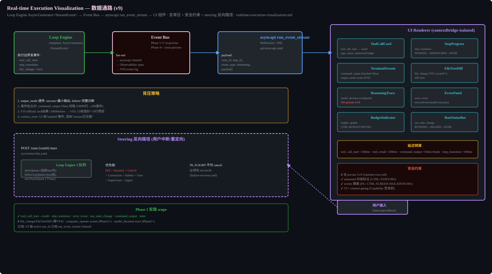

# Real-time Execution Visualization



## Purpose

This spec defines the data path from Loop Engine execution events to UI rendering. It closes the framework gap where `runtime-core.md` defines `LoopEngine.run(plan): AsyncGenerator<StreamEvent>` and `api/asyncapi.yaml` defines event channels, but no spec connects the two into a renderable real-time workspace.

This is the architecture backing the "virtual computer" UX: the user watches the agent work in real time. Without this spec, Phase 1 implementers do not know how StreamEvent reaches the UI, and will build inconsistent ad-hoc rendering.

## Data Path

Loop Engine emits StreamEvent at each execution boundary. Event Bus fans out to asyncapi run_event_stream channel (WebSocket/SSE) and UI Renderer (contextBridge-isolated).

- Loop Engine: `run(plan): AsyncGenerator<StreamEvent>`, emits at tool_call_start, step_transition, file_change, error
- Event Bus: Phase 1-3 in-process, Phase 4+ cross-process. Fan-out to: asyncapi channel, Observability span, VFS event log
- asyncapi run_event_stream: WebSocket/SSE per `api/asyncapi.yaml`. Payload: {run_id, step_id, event_type, timestamp, payload}
- UI Renderer: contextBridge-isolated renderer process

## StreamEvent Types

| EventType | Source | UI Component | Latency Budget |
|-----------|--------|--------------|----------------|
| `tool_call_start` | Loop Engine tool dispatch | ToolCallCard | <100ms |
| `tool_result` | Tool execution result | ToolCallCard | <200ms |
| `step_transition` | Step state change | StepProgress | <100ms |
| `command_output` | execute_command_sandboxed | TerminalStream (batched 50ms) | <50ms/chunk |
| `file_change` | VFS /scratch/* writes | FileTreeDiff | <100ms |
| `model_decision` | Model API Gateway | ReasoningTrace (collapsed) | <200ms |
| `error_event` | Error classification | ErrorPanel | <100ms |
| `budget_update` | BudgetGuard consumption | BudgetIndicator | <100ms |
| `run_state_change` | Run state machine | RunStatusBar | <100ms |
| `workflow_graph` | AgentGraph node status change + routing_slip step progress | WorkflowGraphView (DAG, current node highlighted) | <100ms |

## UI Components

| Component | Renders | Notes |
|-----------|---------|-------|
| ToolCallCard | tool_call_start → result, args, status, authorized badge | Shows capability token authorization |
| StepProgress | step_transition PENDING→DISPATCHED→DONE | Progress bar |
| TerminalStream | command_output (batched 50ms) | output_mode aware (F10) |
| FileTreeDiff | file_change (VFS /scratch/*) | diff view |
| ReasoningTrace | model_decision (collapsed) | NO private CoT |
| ErrorPanel | error_event | network/tool/model/truncation classification |
| BudgetIndicator | budget_update | CTRL-BUDGET-PEP-001 |
| RunStatusBar | run_state_change RUNNING→PAUSED→DONE | |

## Backpressure Strategy

The UI must not become a bottleneck. Controls:

1. **output_mode passthrough** (tool-skill-fabric.md): `execute_command_sandboxed` with `output_mode=summary` sends only exit code + line count on success; full output only on failure. The UI TerminalStream respects this.
2. **Event batching**: `command_output` events are batched at 50ms intervals. 10000 lines of test output becomes ~200 events instead of 10000.
3. **Mechanical offload coupling** (F10): when a tool result exceeds `offload_token_threshold` (default 20000 tokens), the full result is written to VFS `/scratch/*` and the UI receives a file pointer + 10-line preview. Prevents large tool outputs from flooding both context window and UI.
4. **Compaction awareness**: when `context_reset` triggers (runtime-core.md), the UI receives a `context_reset` event and renders a "session handed off" indicator.

## Security Constraints

1. **No private CoT in UI**: `model_decision` events contain only plan, decision summary, tool calls, evidence, and error classification. The UI never renders raw model reasoning text.
2. **Untrusted content labeling**: tool results, RAG content, and web output rendered in the UI carry `trust_level: "untrusted"` labels (CTRL-TAINT-001). The UI visually distinguishes trusted from untrusted content.
3. **Screen isolation** (F6 / CTRL-SCREEN-ISOLATION-001): computer use screen content is isolated; the UI renders screenshots only through an approved rendering path.
4. **T2+ consent gating**: actions requiring consent (T2+) are gated before capability issuance. The UI shows a consent dialog; the action does not execute until the user approves.

## Workflow Graph Visualization (G-PI3)

When AgentGraph.execution_mode is static_dag or routing_slip (Phase 3+), the UI renders the graph topology with current execution state.

### Event payload
```json
{
  "run_id": "uuid",
  "event_type": "workflow_graph",
  "payload": {
    "nodes": [{"agent_id":"A","role":"supervisor","status":"completed"}, {"agent_id":"B","role":"worker","status":"running","isolation":"worktree"}],
    "edges": [{"from":"A","to":"B","edge_type":"delegation"}],
    "execution_mode": "static_dag",
    "routing_slip_progress": null
  }
}
```

### Emission triggers
- Node status change (pending→running, running→completed/failed)
- routing_slip step executed or inserted
- workflow_script phase transition

### Backpressure
Full graph snapshot on first event, then deltas. For DAGs >50 nodes, UI renders collapsed groups by default.

### Phase mapping
- Phase 3: static_dag + routing_slip graph visualization
- Phase 6: workflow_script phase visualization (mission layer)

## Steering Reverse Path (user interrupt/redirect)

User input (interrupt/redirect) → POST /runs/{runId}/steer (asyncapi channel: runs/{runId}/steering) → ui/screens/chat.yaml → Loop Engine 3 queues:

- steerQueue (within current turn)
- followUpQueue (after current turn)
- nextTurnQueue (next user turn)

Priority: Kill > Security > Cancel > Correction > Admin > User > Supervisor > Agent

IN_FLIGHT cannot be cancelled: must reconcile first (see `failure-recovery.md`).

## Phase 1 Implementation Scope

### In scope (Phase 1)
- tool_call_start → result
- step_transition
- error_event
- run_state_change
- command_output
- steer (steering reverse path)

### Out of scope (later phases)
- file_change / FileTreeDiff (needs VFS — Phase 2+)
- computer_operate screen (Phase 3+)
- model_decision trace (Phase 2+)

## Subscription Model

The UI subscribes to the `run_event_stream` channel by `active run_id`. Only events for the active run are rendered. Historical events are available via the event log (VFS StateBackend).


