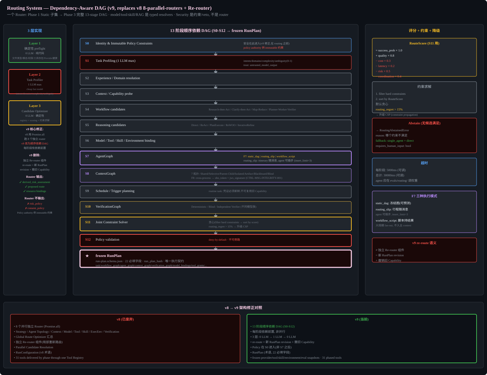

# Routing System (v9: Dependency-Aware DAG)




## v9 Correction: one Router, not parallel independent routers

v8 used Promise.all for 8 independent routers. v9 replaces with sequential dependency-aware DAG.

The product exposes one Router authority. Model selection, tool discovery, skill discovery, RAG retrieval, environment selection, AgentGraph planning, and verification planning are typed resolvers inside that Router pipeline. Security is not a router: immutable Policy constrains inputs and PEP can veto every action. This avoids contradictory decisions and gives each RunPlan one auditable routing record.

### Phase composition

- Phase 1 implements `StaticRouter`: typed intent profiling, deterministic hard-constraint filtering, and selection of direct, ReAct, or plan_execute for one agent. It binds a frozen provider/tool/skill/environment/eval registry snapshot.
- Phase 2 adds Context/RAG resolvers and progressive disclosure, but remains single-agent.
- Phase 3 replaces fixed scoring with the complete dependency-aware DAG, joint optimizer, AgentGraph planning, adaptive fallback, and router eval. It extends the Phase 1 interface rather than creating another router.

## Router DAG Pipeline

```
Identity and immutable policy
  -> Task profiling (1 LLM max)
  -> Experience/domain resolution
  -> Context and capability probe
  -> Workflow candidates
  -> Reasoning candidates
  -> Model/tool/skill/environment binding
  -> AgentGraph
  -> ContextGraph
  -> Schedule/trigger planning
  -> VerificationGraph
  -> Joint constraint solver
  -> Policy validation
  -> frozen RunPlan
```

## Three-Layer Implementation

1. Deterministic preflight (0 LLM) - file type, modality, permissions, tool existence, Provider health
2. 1 structured Task Profiler LLM call (cheap fast model)
3. Deterministic Candidate Optimizer (registry + scoring + constraint solver)

Note: Tool definitions stay stable across DAG nodes; action selection constrained via tool-masking state machine (FG5 CTRL-TOOL-MASK-001, see model-api-gateway.md) to preserve KV-cache across multi-agent runs.

## Router Outputs (v9 correction)

Router outputs:
- derived_risk_assessment (NOT risk_policy)
- proposed route
- resource bindings

Router does NOT output:
- risk_policy
- consent_policy

Policy authority supplies immutable constraints.


## Three Orthogonal Dimensions Diagram


## Implementation Notes

### Router DAG Stage Interfaces

Each stage has a typed input/output. Agent should define TypeScript interfaces matching these.

```typescript
// Stage 1: Task Profiler output
interface TaskProfile {
  intents: Intent[];
  domains: Domain[];
  complexity: ComplexityProfile;
  ambiguity: number;        // 0-1
  trust: "untrusted_model_output";  // always untrusted
}

// Stage 2: Candidate (per router stage)
interface RouterCandidate {
  stage: string;
  selected: any;
  score: number;
  alternatives: any[];
  confidence: number;      // 0-1
  abstain: boolean;
}

// Stage 3: Global Optimizer scoring
// RouteScore = success_probability * w1 + quality * w2 - cost * w3 - latency * w4 - risk * w5 - coordination * w6
// Weights are configurable defaults — agent should tune during Phase 3 eval
```

### Scoring Function
The global optimizer uses a weighted sum. Default weights (agent-tunable):

**Phase 1 simplified (P1-23):** No scoring. Use hard constraint filtering only:
1. Filter by capability (model must support required tools/vision/streaming)
2. Filter by budget (model cost must fit remaining budget)
3. Filter by availability (circuit breaker must be closed)
4. Select cheapest remaining model (sort by price_input + price_output)

**Phase 3+:** Introduce eval-calibrated scoring with the weights below.
- success_probability: 1.0
- quality: 0.8
- cost: 0.3 (USD per 1000 tokens)
- latency: 0.2 (seconds)
- risk: 0.5 (0-1 scale from EffectRisk)
- coordination: 0.4 (multi-agent overhead)

Agent should run the routing eval dataset (`evals/routing/`) and adjust weights to minimize routing regret.

### Constraint Solver
Use a simple greedy approach first (filter by hard constraints, then sort by score). If routing regret > 15% after Phase 3 eval, agent may upgrade to a constraint propagation solver (e.g., `constraint-solver` npm package or custom CSP).

### Timeout per Stage
Default: 5000ms per stage, 30000ms total. Agent-tunable.

### Abstain Behavior
If no candidate meets hard constraints, Router returns `RoutingAbstainedError` with:
- reason: which constraint couldn't be satisfied
- fallback_suggestion: "single_agent + direct strategy"
- requires_human_input: boolean

## Execution Modes (FG7 / FG9)

AgentGraph supports three declared execution modes (`static_dag` | `routing_slip` | `workflow_script`); bounded mass fan-out is a `workflow_script` pattern, not a fourth schema value. The Router selects based on task profile; a mission may compose modes across explicit graph boundaries.

### Mode A: Static DAG (existing)
RunPlan Freeze produces a fixed AgentGraph. Used when the task is well-structured and the plan is predictable. Result merge conflict resolution applies (AH-MULTIAGENT-MERGE-001).

### Mode B: Routing-Slip Choreography (FG7)
AgentGraph.routing_slip carries the itinerary (itinerary, executed, compensations, inserted_steps, insert_limit). For open-ended missions (Founder persona, `AH-CROSSDOMAIN-MISSION-001`, `AH-MISSION-DECOMP-001`) where the next step depends on intermediate results and cannot be frozen up front. The itinerary travels with the message; each agent executes its step, marks complete, and forwards. Agents with `can_edit_itinerary` may insert follow-up steps up to an `insert_limit` (default 3). No central orchestrator; the itinerary is explicit and auditable (visible unlike pure choreography). This is the routing-slip choreography pattern (itinerary travels with the message, no central orchestrator), adopted for AH open-ended missions. Distinct from steering (3 queues): steering is user-injected; itinerary edits are agent-injected within a limit.

### Mode C: Workflow Script (FG9)
For large-scale fan-out (dozens to hundreds of agents) where intermediate results must NOT enter the main agent context. The orchestration is a script (executable, authored by a planner agent) that holds the loop, branching, and intermediate results in script variables. Sub-agents return only final artifacts to the script. The main session context receives only the final answer. This is required because Mode A/B land every sub-agent result in context (or session event log), which at dozens-of-agents scale overflows the window even with compaction. The script is resumable. Built-in pattern: adversarial cross-check (independent agents review each other before reporting).

### Mode D: Mass Fan-Out (Phase 3+)
For homogeneous parallel tasks over many items (e.g. multi-source fan-out research, 500-file migration). Declared as `execution_mode: workflow_script` with a fan-out sub-pattern. The originator spawns N clones (default max 6, bounded by AH-SUBAGENT-001; configurable up to 100 with elevated concurrency grant), each in its own context window and its own sandbox. Each clone is a capability-attenuated agent (tool_grants are a subset of the originator, per AH-SUBAGENT-001) receiving a task slice. The originator aggregates and deduplicates results. Clone budget allocated from originator remaining budget; clone exceeding allocation is killed. Clone failure is non-critical (does not block siblings). Distinct from Mode B (sequential open-ended) and Mode A (fixed topology): fan-out is parallel homogeneous. Note: fan-out concurrency is bounded by AH-SUBAGENT-001 max concurrent (default 6); raising the fan-out max above 6 requires an elevated concurrency grant approved by the Authorization Service.

## Cross-Process Messaging Integrity (FG8)

When AgentGraph executes across processes/hosts (Phase 3 multi-agent, 7 context topologies imply cross-process isolation), TLS only protects the channel. Once a message is queued or persisted, the channel trust boundary breaks. AgentGraph edges of `edge_type: communication` and `result_handoff` carry:
- `obo_token`: On-Behalf-Of delegation token (the agent chain cannot exceed the originating user permissions). Required for Phase 5 external actions (`AH-EXT-CREDENTIAL-001`).
- `jws_signature`: message integrity + authenticity (JOSE/JWS). Optional `jwe` for confidentiality when the broker is shared.

This is declared in `agent-graph.schema.json` field `message_security` (obo_token_required, jws_signature_required, jwe_optional). It complements Capability Token (A14): Capability is per-call authorization signed by the Authorization Service; the message signature is transport integrity. Both are enforced. Control: CTRL-MSG-INTEGRITY-001.
