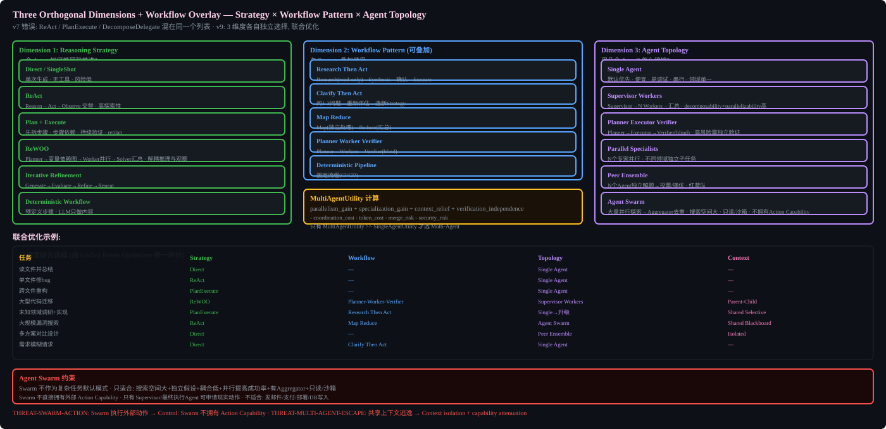

# Routing System (v9: Dependency-Aware DAG)


## v9 Correction: NOT 8 parallel independent routers

v8 used Promise.all for 8 independent routers. v9 replaces with sequential dependency-aware DAG.

## Router DAG Pipeline

```
Identity and immutable policy
  -> Task profiling (1 LLM max)
  -> Experience/domain resolution
  -> Context and capability probe
  -> Workflow candidates
  -> Reasoning candidates
  -> Model/tool/skill/environment binding
  -> AgentGraph
  -> ContextGraph
  -> Schedule/trigger planning
  -> VerificationGraph
  -> Joint constraint solver
  -> Policy validation
  -> frozen RunPlan
```

## Three-Layer Implementation

1. Deterministic preflight (0 LLM) - file type, modality, permissions, tool existence, Provider health
2. 1 structured Task Profiler LLM call (cheap fast model)
3. Deterministic Candidate Optimizer (registry + scoring + constraint solver)

## Router Outputs (v9 correction)

Router outputs:
- derived_risk_assessment (NOT risk_policy)
- proposed route
- resource bindings

Router does NOT output:
- risk_policy
- consent_policy

Policy authority supplies immutable constraints.


## Three Orthogonal Dimensions Diagram



## Implementation Notes

### Router DAG Stage Interfaces

Each stage has a typed input/output. Agent should define TypeScript interfaces matching these.

```typescript
// Stage 1: Task Profiler output
interface TaskProfile {
  intents: Intent[];
  domains: Domain[];
  complexity: ComplexityProfile;
  ambiguity: number;        // 0-1
  trust: "untrusted_model_output";  // always untrusted
}

// Stage 2: Candidate (per router stage)
interface RouterCandidate {
  stage: string;
  selected: any;
  score: number;
  alternatives: any[];
  confidence: number;      // 0-1
  abstain: boolean;
}

// Stage 3: Global Optimizer scoring
// RouteScore = success_probability * w1 + quality * w2 - cost * w3 - latency * w4 - risk * w5 - coordination * w6
// Weights are configurable defaults — agent should tune during Phase 3 eval
```

### Scoring Function
The global optimizer uses a weighted sum. Default weights (agent-tunable):
- success_probability: 1.0
- quality: 0.8
- cost: 0.3 (USD per 1000 tokens)
- latency: 0.2 (seconds)
- risk: 0.5 (0-1 scale from EffectRisk)
- coordination: 0.4 (multi-agent overhead)

Agent should run the routing eval dataset (`evals/routing/`) and adjust weights to minimize routing regret.

### Constraint Solver
Use a simple greedy approach first (filter by hard constraints, then sort by score). If routing regret > 15% after Phase 3 eval, agent may upgrade to a constraint propagation solver (e.g., `constraint-solver` npm package or custom CSP).

### Timeout per Stage
Default: 5000ms per stage, 30000ms total. Agent-tunable.

### Abstain Behavior
If no candidate meets hard constraints, Router returns `RoutingAbstainedError` with:
- reason: which constraint couldn't be satisfied
- fallback_suggestion: "single_agent + direct strategy"
- requires_human_input: boolean
