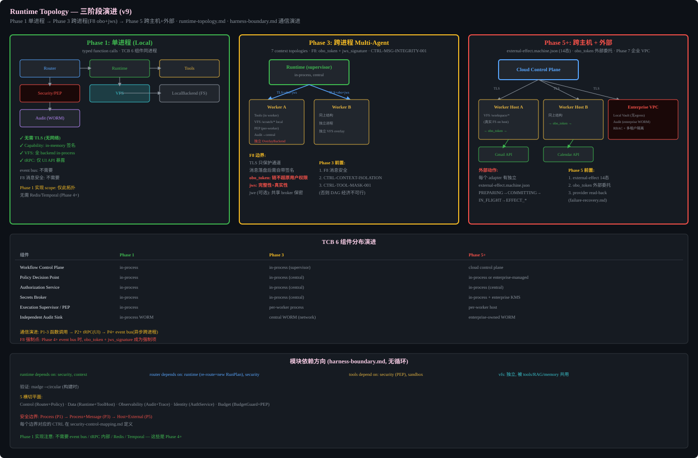

# Runtime Topology

## Purpose

Defines how modules connect at each phase: single-process (Phase 1) → cross-process multi-agent (Phase 3) → cross-host + external (Phase 5+). Without this, F8 (cross-process message integrity) and the TCB trust model cannot be mapped to physical boundaries. `deployment-topology.md` lists environments; this spec lists the connections and trust boundaries at each phase.

## Phase 1: Single-Process (Local)

All modules communicate via typed function calls in the same process. TCB 6 components are co-located.

| Component | Location |
|-----------|----------|
| Router | in-process |
| Runtime | in-process |
| Tools | in-process |
| Security/PEP | in-process |
| VFS | in-process (all backends) |
| LocalBackend | real FS |
| Audit | in-process WORM |

Characteristics:
- No TLS needed (no network)
- Capability: in-memory signing
- VFS: all backends in-process
- Router: Phase 1 StaticRouter only; the Phase 3 adaptive DAG is not pulled forward
- Registries: one immutable RunPlan snapshot for providers, tools, skills, environment, and verification
- tRPC: only for UI API exposure
- Event bus: not needed
- F8 message security: not needed

**Phase 1 implementation scope**: only this topology. No Redis/Temporal needed (Phase 4+).

## Phase 3: Cross-Process Multi-Agent

Supervisor runtime is central (in-process). Worker processes are spawned with their own tools, VFS overlay, and PEP.

| Component | Phase 3 Location |
|-----------|-----------------|
| Runtime (supervisor) | in-process, central |
| Worker A | separate process, own Tools + VFS /scratch/* + PEP |
| Worker B | separate process, same structure |
| Audit | central WORM (network) |

F8 boundary requirements:
- TLS protects the channel only
- Messages landing on disk need self-contained signatures
- `obo_token`: chain does not exceed original user permissions
- `jws_signature`: integrity + authenticity
- `jwe` (optional): shared broker confidentiality

Phase 3 prerequisites:
1. F8 message security (obo_token + jws_signature)
2. CTRL-CONTEXT-ISOLATION-001 (context graph isolation)
3. CTRL-TOOL-MASK-001 (tool-masking, otherwise DAG economically infeasible)

## Phase 5+: Cross-Host + External

Workers run on separate hosts. External action adapters connect to third-party APIs.

| Component | Phase 5+ Location |
|-----------|-------------------|
| Cloud Control Plane | cloud (TLS) |
| Worker Host A | separate host, VFS /workspace/* (real FS) |
| Worker Host B | separate host, same structure |
| Enterprise VPC | on-prem or VPC: Local Vault (no egress), Audit (enterprise WORM), RBAC + multi-tenant isolation |
| External APIs | Gmail, Calendar, etc. via obo_token delegation |

Each external action adapter has its own `external-effect.machine.json` (14 states): PREPARING→COMMITTING→IN_FLIGHT→EFFECT_*.

Phase 5 prerequisites:
1. external-effect.machine.json (14 states) implemented
2. obo_token external delegation
3. provider read-back (see `failure-recovery.md`)

## TCB 6 Components Distribution Evolution

| Component | Phase 1 | Phase 3 | Phase 5+ |
|-----------|---------|---------|----------|
| Workflow Control Plane | in-process | in-process (supervisor) | cloud control plane |
| Policy Decision Point | in-process | in-process (central) | in-process or enterprise-managed |
| Authorization Service | in-process | in-process (central) | in-process (central) |
| Secrets Broker | in-process | in-process (central) | in-process + enterprise KMS |
| Execution Supervisor / PEP | in-process | per-worker process | per-worker host |
| Independent Audit Sink | in-process WORM | central WORM (network) | enterprise-owned WORM |

## Communication Evolution

- Phase 1-3: typed function calls (same process)
- Phase 2+: tRPC (UI API exposure)
- Phase 4+: event bus (async cross-process)

F8 enforcement point: when Phase 4+ event bus is active, `obo_token + jws_signature` becomes mandatory.

## Module Dependency Direction (harness-boundary.md, no cycles)

- router depends on: contracts, registry read interfaces, and Policy constraint interfaces; never on Runtime implementation
- runtime depends on: contracts, security, context, VFS, and gateway interfaces; it consumes frozen RunPlan revisions
- tools depend on: Tool Registry interfaces, security (PEP), VFS, and sandbox
- vfs: independent, shared by tools/RAG/memory

Re-route is an event emitted by Runtime and consumed through the Router interface to create a new RunPlan revision; this does not introduce a package cycle.

Verify with: `madge --circular` (at build time)

## 5 Cross-Cutting Planes

| Plane | Owner | Records | Security Boundary |
|-------|-------|---------|-------------------|
| Control | Router + Policy | RunPlan, Policy decisions | Only CTO can modify |
| Data | Runtime + Tool Host | Tool I/O, file changes | Worker can modify harness/ |
| Observability | Audit + Trace | Spans, metrics, logs | Read-only for workers |
| Identity | Auth Service | Principals, tokens, capabilities | Only Auth Service can issue |
| Budget | Budget Guard + PEP | Budget ledger, consumption | Hard-enforced in PEP |

Security boundaries: Process (P1) → Process + Message (P3) → Host + External (P5). Each boundary's CTRL mapping is in `security-control-mapping.md`.

## Phase 1 Implementation Note

Phase 1 does NOT need: event bus, tRPC internals, Redis, Temporal. These are Phase 4+.

