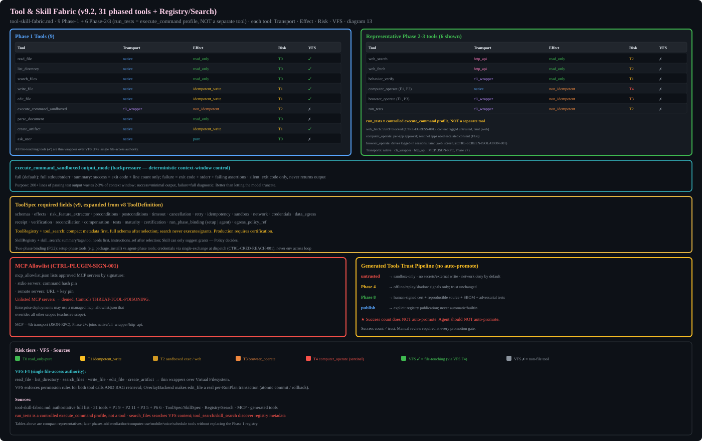

# Tool & Skill Fabric

## ToolSpec (v9 expanded from v8 ToolDefinition)
Every tool must have: schemas, effects, risk_feature_extractor, preconditions, postconditions, timeout, cancellation, retry, idempotency, sandbox, network, credentials, data_egress, receipt, verification, reconciliation, compensation, tests, maturity, certification.

Only production_certified tools enter production Registry.

## Phase 1 Tools (9, reduced from v8's 20)
read_file, list_directory, search_files, write_file, edit_file, execute_command_sandboxed, parse_document, create_artifact, ask_user

run_tests is a controlled execute_command profile, NOT a separate tool.

## Tool Transport (4 types)
Native (in-process), CLI Wrapper (subprocess), MCP (JSON-RPC), HTTP API

## SkillSpec
Must include: input/output schema, required context, required tools, allowed effect classes, workflow template, verification template, failure policy, risk ceiling, eval suite.
Skill can only SUGGEST tool grants. Policy decides.

## Generated Tools
ALWAYS: untrusted, sandbox-only, no secrets, no external writes, network denied by default, manual publication required. Success count does NOT auto-promote to trusted.
