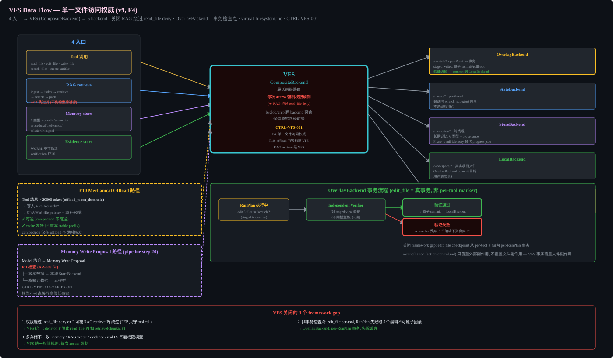

# Virtual Filesystem (FG4)




## Why a VFS exists

Without a single file-access authority, AH has four independent file surfaces: tool `read_file`/`edit_file` (PEP-checked at call time), RAG retrieval (ACL-filtered but a separate permission path), evidence store, and the real OS filesystem. This creates three framework-level failures:

1. **Permission bypass**: a `read_file` deny on path P can be circumvented by retrieving P through RAG, because the indexed chunk is served by the retrieval path, not the tool path. PEP only guards the tool call.
2. **Non-transactional checkpoints**: `edit_file` checkpoints are per-tool, not per-RunPlan. If a RunPlan edits 5 files and fails on the 6th, the 5 edits cannot be rolled back atomically. `reconciliation` (architecture/action-control.md) only covers external side effects, not file side effects.
3. **Multi-store inconsistency**: memory store, RAG vector store (LanceDB), evidence dir, and real FS have four different consistency and permission models.

The VFS is the single authority through which all file-touching tools, RAG retrieval, memory, and evidence operate.

## VFS Model

```
Tool call (read_file/edit_file/...) ─┐
RAG retrieve                          ├──► VFS ──► Backend (routed by path)
Memory store                          │
Evidence store                        ┘
```

### Backends (pluggable, routed by path prefix)

| Backend | Scope | Use |
|---------|-------|-----|
| OverlayBackend | per-RunPlan scratch | staged writes, atomic commit/rollback boundary |
| StateBackend | per-thread | in-session scratch (subagent-shared) |
| StoreBackend | cross-thread | long-term memory (`/memories/*`) |
| LocalBackend | project dir | real project files (`/workspace/*`) |
| CompositeBackend | router | routes by path prefix (longest prefix wins) |

### OverlayBackend = transactional checkpoint

A RunPlan's file edits stage in an OverlayBackend. The Independent Verifier runs against the staged view. On verification pass, the overlay commits atomically to the LocalBackend; on failure, the overlay is discarded and the 5 partial edits never reach the real FS. This makes `edit_file` checkpoint a real transaction, not a per-tool marker.

### Permission rules

VFS enforces read/write permission rules per path prefix, evaluated for EVERY access regardless of caller (tool or RAG). This closes the RAG-bypasses-read_file-deny hole: RAG retrieval goes through VFS, so a deny on path P blocks both `read_file(P)` and `retrieve(chunk@P)`.

### CompositeBackend routing example

- `/workspace/*` -> LocalBackend (real project files)
- `/memories/*` -> StoreBackend (cross-thread durable)
- `/scratch/*` -> OverlayBackend (per-RunPlan transactional)
- `/evidence/*` -> EvidenceBackend (WORM)

`ls`/`glob`/`grep` aggregate across backends and preserve original path prefixes.

## Control

CTRL-VFS-001: Virtual filesystem as single file-access authority with backend routing and permission rules.

VFS is a Phase 1 dependency, not a later optimization. The coding/document/research verticals cannot be considered complete while file tools or Evidence bypass it. Phase 2 RAG, Phase 4 Memory, Phase 5 external receipts, and Phase 6 mission handoffs add consumers to the same interface; they do not create new file authorities.

## Relationship to existing modules

- `tool-skill-fabric.md`: file tools (`read_file`, `write_file`, `edit_file`, `search_files`) are thin wrappers over VFS.
- `action-control.md`: step 9 (sandbox dispatch) becomes VFS dispatch for file-touching tools; PEP still authorizes, but VFS enforces the access.
- `context-memory-rag.md`: RAG retrieve goes through VFS so ACL/permission is unified; offloaded content (FG10) lands in VFS.
- `assurance.md`: Independent Verifier runs against the OverlayBackend staged view before commit.
